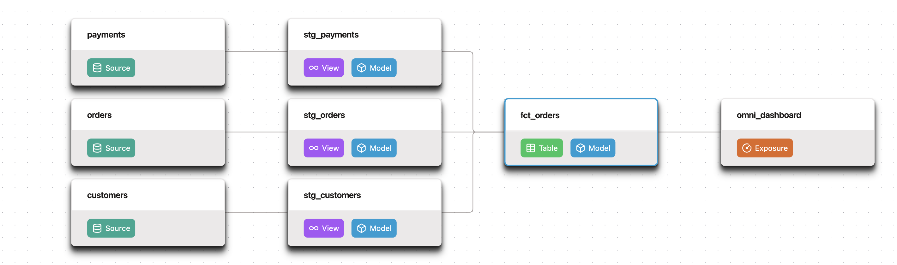

  

  

> [!WARNING]
> **dbt v1 development has moved to the [`1.latest`](https://github.com/dbt-labs/dbt/tree/1.latest) branch.**
> The `main` branch now contains all the Apache 2.0 source code of dbt v2.0 — a ground-up rewrite of dbt in Rust. If you're looking for the v1 Python implementation of the dbt framework, switch to [`1.latest`](https://github.com/dbt-labs/dbt/tree/1.latest).

**[dbt](https://www.getdbt.com/)** enables data analysts and engineers to transform their data using the same practices that software engineers use to build applications.

## About dbt v2.0

dbt v2.0 is engineered for performance at scale. It parses, compiles, and runs projects in a fraction of the time compared to v1. The source code in this repository is available to everyone under the standard Apache 2.0 license. [dbt](https://docs.getdbt.com/docs/introduction) is a distribution of the dbt repository with dbt-specific customizations released under a [dbt product license](https://www.getdbt.com/dbt-fusion-engine-license-agreement).

The big shifts from v1:

- **Faster** — parse and compile times are dramatically improved, especially on the largest dbt projects.
- **Stricter** — a tightly-defined language specification enforces correctness at parse time.
- **More scalable artifacts** — v2.0 produces Parquet artifacts that can be easily queried, joined, and analyzed to understand your dbt project. The artifacts encompass everything in the JSON artifacts (e.g. `manifest.json`), which continue to be produced for backwards compatibility.
- **Easier to install** — distributed as a single self-contained binary, with no Python runtime or dependency management required.
- **A completely revamped local documentation experience** — dbt docs is now powered by those new artifacts and capable of scaling to large projects.

### Supported operating systems and architectures

dbt v2.0 and its drivers are compiled per operating system and architecture.

Legend:
* 🟢 — Supported today
* 🟡 — Not yet supported

| Operating system | x86-64 | ARM |
|---|---|---|
| macOS | 🟢 | 🟢 |
| Linux | 🟢 | 🟢 |
| Windows | 🟢 | 🟡 |

## Understanding dbt

Analysts using dbt can transform their data by simply writing select statements, while dbt handles turning these statements into tables and views in a data warehouse.

These select statements, or "models", form a dbt project. Models frequently build on top of one another – dbt makes it easy to [manage relationships](https://docs.getdbt.com/docs/ref) between models, and [visualize these relationships](https://docs.getdbt.com/docs/documentation), as well as assure the quality of your transformations through [testing](https://docs.getdbt.com/docs/testing).

## Getting started

* [Install dbt](https://docs.getdbt.com/docs/local/install-dbt?version=2)
* Read the [introduction](https://docs.getdbt.com/docs/introduction/) and [viewpoint](https://docs.getdbt.com/docs/about/viewpoint/)
* Explore the [dbt platform](https://docs.getdbt.com/docs/cloud/about-cloud/dbt-cloud-features) for an enhanced collaboration experience.

## Join the dbt Community

- Be part of the conversation in the [dbt Community Slack](http://community.getdbt.com/)
- Read more on the [dbt Community Discourse](https://discourse.getdbt.com)

## Reporting bugs and contributing code

- Want to report a bug or request a feature? Let us know and open [an issue](https://github.com/dbt-labs/dbt/issues/new/choose)
- Want to help us build dbt? Check out the [Contributing Guide](https://github.com/dbt-labs/dbt/blob/HEAD/CONTRIBUTING.md)

## Code of Conduct

Everyone interacting in the dbt project's codebases, issue trackers, chat rooms, and mailing lists is expected to follow the [dbt Code of Conduct](https://docs.getdbt.com/community/resources/code-of-conduct).

## License

The source code in this repository is licensed under the [Apache License 2.0](LICENSE).
